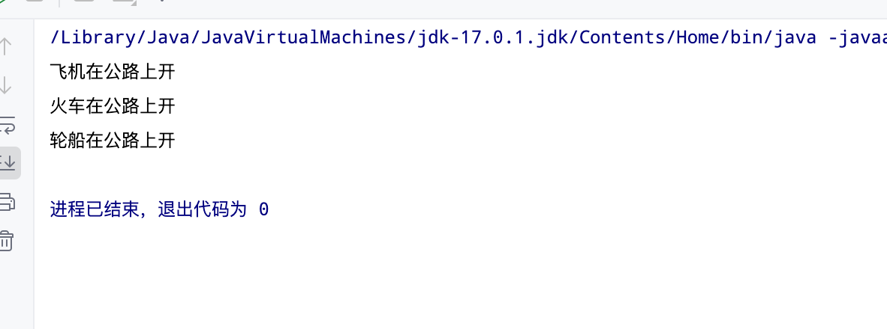

单一职责原则，我们在设计类的时候尽量只负责一项功能，A类只负责功能A，B类只负责功能B，尽量避免A类即负责A功能又负责B功能，这样会导致代码混乱，容易产生bug


未使用单一职责原则代码

#### Vehicle类
```java

public class Vehicle {
    void run(String type){
        System.out.println(type + "在公路上开");
    }
}

```

#### Single类
```java 
public class Single {
    public static void main(String[] args) {
        Vehicle vehicle = new Vehicle();
        vehicle.run("飞机");
        vehicle.run("火车");
        vehicle.run("轮船");
    }
}
```

#### 运行结果:


