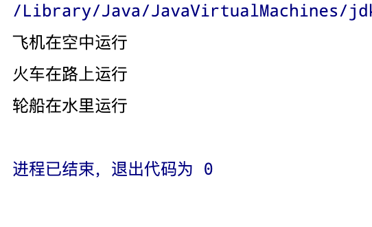

单一职责原则，我们在设计类的时候尽量只负责一项功能，A类只负责功能A，B类只负责功能B，尽量避免A类即负责A功能又负责B功能，这样会导致代码混乱，容易产生bug


### 未使用单一职责原则代码

#### Vehicle类
```java

public class Vehicle {
    void run(String type){
        System.out.println(type + "在公路上开");
    }
}

```

#### Single类
```java 
public class Single {
    public static void main(String[] args) {
        Vehicle vehicle = new Vehicle();
        vehicle.run("飞机");
        vehicle.run("火车");
        vehicle.run("轮船");
    }
}
```


<Card title="运行结果" icon="twemoji:astonished-face">
  可以看出汽车在公路上开是正常行为，但是火车或轮船并不能在公路上运行，所以Vehicle类负责不止一个功能，因此该类设计是有问题的！
</Card>

### 使用单一职责原则代码

#### RoadVehicle类

``` java
public class AirVehicle {
    public void run(String type){
        System.out.println(type+"在空中运行");
    }
}
```

#### RoadVehicle类

``` java
public class RoadVehicle {
    public void run(String type){
        System.out.println(type+"在路上运行");
    }
}

```

#### WaterVehicle类

``` java
public class WaterVehicle {
    public void run(String type){
        System.out.println(type+"在水上运行");
    }
}

```

<Card title="运行结果" icon="noto:astonished-face">
这里将原有的Vehicle类的功能进行了拆分，这里符合一个使用单一原则。但是缺点代码多了，显得冗余。我们可以把类的方法合并到一个类下面去，单一职责落在方法层面。
</Card>

### 使用单一职责原则代码落在方法上

#### Single类

``` java
public class Single {
    public static void main(String[] args) {
        Vehicle vehicle = new Vehicle();
        vehicle.runAir("飞机");
        vehicle.runRoad("火车");
        vehicle.runWater("轮船");

    }
}
```

#### Vehicle类

``` java
public class Vehicle {
    public void runRoad(String type){
        System.out.println(type+"在路上运行");
    }

    public void runWater(String type){
        System.out.println(type+"在水里运行");
    }

    public void runAir(String type){
        System.out.println(type+"在空中运行");
    }

}
```




<Card title="运行结果" icon="noto:beaming-face-with-smiling-eyes">
  降低风险，只修改一个类，并不影响其他类的功能。
</Card>


